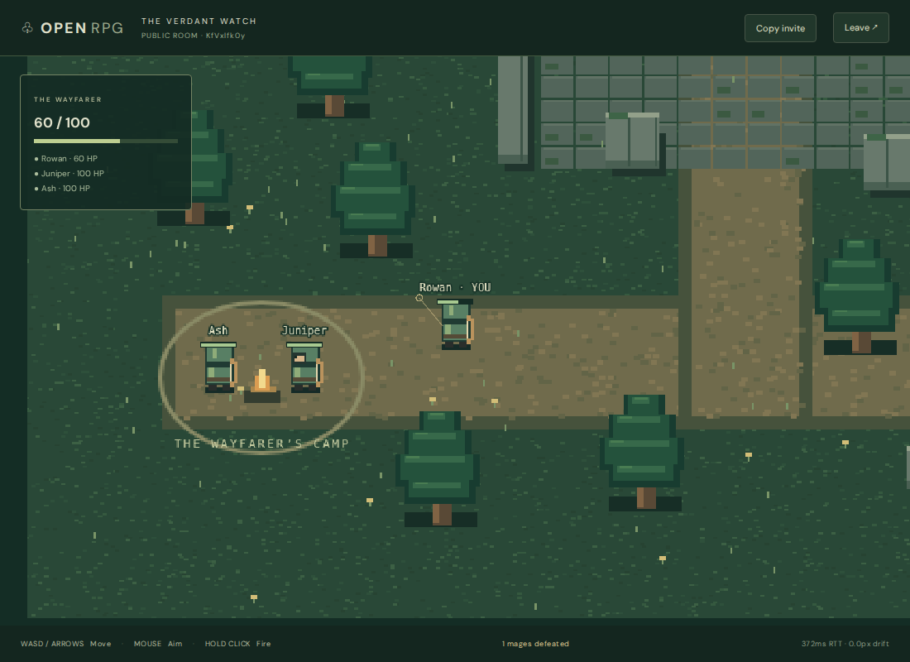

# Verification record

## Unrestricted boss encounters and Story enemy lives — 2026-09-28

- Removed the boss seal and its synchronized flag, damage gate and client visuals. Bosses can fight while guards remain alive; music still follows the first confirmed hit.
- Story enemies have one life. Completion still requires every enemy to be defeated, in any order. Testing retains unlimited respawns.
- Regression coverage checks melee/projectile damage and boss attacks with all guards alive on every map in both modes, permanent Story deaths beyond the respawn timer, and first-life Story completion/progression.
- `npm run check` passed: lint, formatting, typechecks, 142 unit/integration tests and production builds. Existing Phaser chunk-size warning remains. Browser route assertions were updated and typechecked; browser scenarios were not rerun for this change.


## Distinct map layouts and charge-only normal attacks — 2026-09-27

- Each realm now has its own file under `shared/src/world/routes/`: Forest forks, Castle chambers with offset doors, Paradise garden loops, Hell islands and bridges, and Mountain switchbacks. All actor footprints can reach every encounter. Additional checks verify alternative garden paths, castle doorways, island separation and the mountain’s required westward traversal.
- Normal attacks retain class charge durations and sweet-spot damage, with no post-release cooldown. `lastAttackAt` records confirmed releases for audio; it never gates attacks. Armor shortens primary charge time and special cooldowns. The HUD and ring no longer show normal recovery.
- `npm run check` passed lint, formatting, typechecks, **128 unit/integration tests** and all builds. Coverage includes immediate recharging for all classes, one hit per release, unchanged special deadlines, armor timing, cancellation, and alternating press/release flooding through the real fixed-step input queue. The existing Phaser bundle-size warning remains.
- **Four targeted Chromium scenarios passed across focused runs**: all five map previews/create/render/leave; charge/release/recharge/overcharge/blur/reconnect for every class, normally and at approximately 150 ms RTT with jitter; and a Forest route clearing guards, unlocking the boss, confirming first-hit music and returning to the menu. Browser runs used `--trace off`. Delayed cancellation waits for its authoritative patch instead of a fixed 350 ms sleep; the route smoke permits Testing’s normal death/respawn behavior. Early runs exposed those test assumptions. Final browser test files also passed lint, formatting and typechecks.
- Visually inspected a combined render of all five layouts. Local simulation CPU smoke: three rooms, nine players, 36 enemies, 3,000 ticks; combined mean **0.62 ms**, p95 **2.36 ms**, maximum **9.69 ms**. This is a local CPU check, not a deployment capacity guarantee.
- Updated README and architecture ownership/timing notes. No dependencies or database migrations added.

## Linear routes, difficulty ramp and boss music — 2026-09-27

- Reauthored the five maps as 3456 × 1024 journeys with solid corridor banks, bends, cover and a final arena. Every player/enemy footprint can navigate from camp to all encounters. Encounter counts are now 5/7/8/10/12, and boss rotations contain 2/3/4/5/7 distinct patterns.
- Forest has slower movement/strafe, weaker hits, longer warnings and pauses, and a 450-HP boss. Mountain has more mixed encounters, faster warnings/projectiles, stronger enrage and a 1440-HP boss. Shared typed configuration owns the difficulty progression.
- Added authoritative boss seals and engagement state. Tests cover both melee/projectile rejection while sealed, every guard’s required lives in Testing/Story, sticky unlock through Testing respawns, and first-hit engagement. Audio tests cover mute, reconnect, retreat, death, outcome and respawn behavior without replaying old effects.
- `npm run check` passed: lint, formatting, workspace/test typechecks, **126 unit/integration tests**, and all production builds. Focused seal/audio tests were rerun after adding further assertions. Existing Phaser bundle warning remains.
- **Nine targeted Chromium scenarios passed across focused runs**: all-map preview/create/render/leave; four audio scenarios (including offline rendering of all 40 music bars); all five Fight maps; three-player damage/respawns normally and at approximately 150 ms RTT with jitter; and an actual Forest guard-to-boss route using keyboard/mouse controls. The route check confirms the seal opens, first damage changes the score, and leaving restores menu music. It uses quick warrior sweeps; charge timing and boss death/reset behavior have separate tests. The route smoke passed with `--trace off`; the other checks used the usual tracing configuration. Menu/map/boss screenshots were inspected. Early attempts exposed unsuitable bot aiming/charging assumptions; a rebuild and overlapping trace output also interrupted early runs. The final checks used stable builds and separate runs.
- Three-room CPU smoke check: nine players, **36 enemies**, active bosses, 3,000 ticks; combined mean **0.45 ms**, p95 **2.20 ms**, maximum **16.16 ms** against the 33.33 ms tick interval. This is local simulation CPU, not a deployment capacity estimate.
- No dependencies, database migrations, external art/music assets or extra network message streams were added. Test accounts are cleaned up after browser runs.

## Larger realms and enemy tactics — 2026-09-27

- Expanded all five realms to 2304 × 1728 (2.56× the original area), with authored lakes, ramparts, terraces, lava causeways, chasms, named regions and distinct boss arena motifs. Encounter counts increase from six to ten in story order. Testing/Story life rules and player-only Fight remain intact.
- Added typed attack rotations, gap-closing charges, staggered bursts, paired cross volleys and marked ground blasts. Melee flank; ranged enemies retreat/strafe; bosses lead movement slightly and enrage below half health. Wind-ups lock their geometry and retain their full dodge window during enrage.
- `npm run check`: lint, formatting, typechecks, **123 unit/integration tests**, and production builds passed. The 16 new tests cover increasing mechanical difficulty, large-footprint navigation through every map, all five boss rotations/enrage/resets, locked warnings, swept charges, wall/immune/camp protection, burst cancellation, projectile limits, and escaping exact wall contact without cutting corners. Existing Phaser chunk-size warning remains.
- CPU smoke check: `npx tsx scripts/benchmark-simulation.ts`, three Mountain simulations, nine players, **30 enemies**, 3,000 ticks. Combined tick cost: mean **0.54 ms**, p95 **5.48 ms**, maximum **12.59 ms**, against a 33.33 ms fixed-step interval on this development machine. Invulnerable moving test players keep encounters active. This measures simulation CPU only, not network/database throughput or deployment capacity.
- **Eight targeted Chromium scenarios passed across focused runs**: preview/create/leave all five destinations, all five player-only Fight maps, ordinary and delayed three-player Fight damage/respawns, cooperative NPC combat/loot, a real walk into the expanded forest and boss warnings, delayed movement/abilities/recovery, and delayed charge/cancellation. The latency helper simulates approximately 150 ms RTT with jitter; maps/menu and boss-warning screenshots were inspected.
- Updated browser coverage separates AI targeting from transport assertions: normal-latency cooperative combat pursues retreating mobs around cover; delayed damage uses a controlled PvP opponent, while delayed movement/abilities/recovery remain in Testing. This avoids requiring a scripted archer to defeat evasive enemies within a fixed time as a proxy for network correctness. The server/unit tests still assert full attack counts and collision outcomes. Initial browser runs also exposed the exact-wall-contact navigation bug (fixed and regression-tested); development reload/process interruptions were rerun after the server stabilized.
- No new dependencies or database migrations. Mob schema adds locked warning coordinates/timing and enrage state; simulation cadence and client input messages are unchanged.

## Code organization and linting — 2026-09-27

- Grouped client features, game views/HUD, original art, UI helpers and styles; grouped shared world, protocol, profile, combat and inventory code. Public shared exports and synchronized schema remain compatible.
- Extracted public room browsing, HUD messages, development diagnostics, shared client HTTP transport, server HTTP guards/errors and session cookies. Split inventory rules and moved workshop markup into a readable HTML template.
- Added ESLint with TypeScript rules and type-aware promise checks, Prettier, root lint/format/check commands, lockfile updates and [development conventions](development.md). Comments explain authority, input bounds, replay, async lifetime and reward retries.
- `npm run check` passed from cleared shared/server build output: lint, formatting, package/test typechecks, **107 unit/integration tests**, and all production builds. Five new HTTP-helper tests cover credentials, empty responses, expired sessions, malformed errors and transport failures. Existing Phaser chunk-size warning remains.
- Full Chromium suite: **24 passed**, including three-player combat at 150 ms RTT with jitter, public/private room lifecycle, reconnection, respawns, charged attacks, accounts, skins, equipment, loot/shop and audio. Menu and arena screenshots inspected.
- All **three skin-editor scenarios passed again** after extracting/formatting the final HTML template; production client build and formatting rechecked. The first editor rerun was blocked by the development watcher stopping while generated shared output was cleared; restarting that watcher restored the server, with no application fix needed.
- No gameplay tuning, persistence schema or migration changes. Tooling requires Node 22.13+ (22.x) or 24+.

## Fight mode and audio startup — 2026-09-27

- Added Fight beside Testing/Story: all five maps, three-player free-for-all, no mobs/AI, unlimited three-second respawns with existing protection. Shared combat handles player projectiles, specials and sword sectors, excludes self/dead/disconnected targets, and preserves terrain and immunity checks. Kills are room-local; no monster loot or story rewards.
- Lobby previews hide monster markers; listings and HUD identify Fight. Rivals use distinct labels/health bars, and nearby rival hits have sound cues. Gear and packed-potion rules are unchanged.
- Audio attempts playback on mount unless muted, and page-wide clicks/taps retry after autoplay blocking. Chromium checks use explicit permitted/blocked policies and non-activating CDP reads; tracing is disabled only in that test file because its snapshots can grant activation.
- Production build, workspace/test typechecks and all **102 unit/integration tests passed**. Existing Phaser chunk-size warning unchanged.
- **Eight Chromium browser checks passed**, including all five Fight maps, three independent accounts joining by listing/room ID, synchronized player damage/death/respawn, and both autoplay policies. Fight menu/game screenshots inspected. Test accounts cleaned up.
- **Four Firefox audio checks passed**, covering mute persistence, page-content activation, focus suspension, synthesis and adventure cleanup. Safari remains unverified on this host as noted below.
- No dependencies, migrations, synchronized schema fields or network messages added.

## Distinct menu and adventure music — 2026-09-27

- Replaced short similar phrases with original 16-bar scores: gentle G-major 6/8 menu and rhythmic D-minor 4/4 adventure. Soft onset envelopes apply to music; existing effect recipes remain unchanged.
- Production build, workspace/test typechecks and `git diff --check` passed.
- Four audio browser scenarios passed in Chromium and Firefox (eight total). Every bar of both scores rendered non-silent, below clipping and within the voice limit; existing mute, focus, charge, reconnect and menu/adventure switching checks passed.
- No dependencies, downloaded audio, server or network changes. Safari verification remains subject to the host limitation recorded below.

## Browser audio — 2026-09-27

- Production build, workspace/test typechecks and `git diff --check` passed. Existing Phaser chunk-size warning unchanged.
- `npm test`: **92 passed**, including authoritative audio-event classification, deduplication, distance attenuation and silent join/reconnect/unmute baselines.
- Chromium and Firefox: **all three audio browser scenarios passed in each browser** (six total across runs). They cover mute persistence/keyboard access, background suspension, unavailable-audio fallback, offline rendering of every recipe, the 32-voice cap, and real adventure charging/reconnect/leave cleanup.
- All sound recipes rendered non-silent finite output below full scale. Offline rendering waits for asynchronous source-end callbacks (Firefox delivers these after rendering resolves).
- Fixed a suspended-context cleanup edge case: stopped voices also disconnect on wall time, so delayed `ended` callbacks cannot retain muted nodes. Menu and adventure screenshots were visually checked.
- WebKit runtime downloaded, but launch is blocked on this host by missing `libevent-2.1-7t64` / `libavif16`. Safari/iOS device playback remains unverified; the implementation uses standard Web Audio and gesture-based unlocking. No system packages were changed.
- No server/schema, database, npm dependency or external audio asset changes. Tests clean up only their own accounts.


## Charged attacks and warrior sweep — 2026-09-27

- Production build and workspace/test typechecks passed; the existing Phaser chunk-size warning remains.
- Full unit/integration runner (`npx tsx --test tests/*.test.ts`, after rebuilding shared): **88 passed**.
- Coverage includes damage before/in/after the sweet window for every class, charge/cooldown flooding, cancellation and stale input, reconnect/respawn cleanup, equipment modifiers, moving sword attacks, multi-target sectors, edge grazes, walls and synchronized attacks.
- **Four browser scenarios passed across runs:** all-class charging/release/overcharge/blur/reconnect checks with and without 150 ms RTT, plus three-player combat/loot/movement/abilities with and without 150 ms RTT and jitter. No browser page errors were reported by the passing checks.
- Charge-ring and moving sword-sector screenshots were visually inspected. No dependencies, migrations or audio were added.

Older instant-fire tests were updated to send release and wait for its subsequent state patch. The latency combat driver now schedules release independently of its slower aim/telemetry loop; room selection targets its own unique host rather than assuming only one public room exists. Final reruns passed. Server-authoritative release timing can still differ slightly from the cosmetic local ring near sweet-window boundaries under jitter; historical input rewind remains out of scope.


## Loot and shop update — 2026-09-27

- `npm test`: 83 passed, including seven new loot/shop tests and updated room/migration coverage.
- `npm run build`, `npm run typecheck`, and `git diff --check`: passed. The existing Phaser bundle size warning remains.
- Tests exercise personal pickup ownership, living/connected checks, wall occlusion, expiry/caps, post-victory collection, duplicate stacks, idempotent saves, concurrent purchases/sales, storage limits, migration preservation, authenticated trading and forged-price rejection.
- Browser checks cover physical drops from real combat, walk-to-collect persistence, three-player play with 150 ms RTT/jitter, shop balances and duplicate sales, sold-loadout reset, reload persistence, mobile layout, and animated equipment over unchanged custom-skin pixels.
- Desktop/mobile shop, ground-loot and custom-skin equipment screenshots were inspected. No new dependencies were added.

The first shop reload check overlapped a development-server restart during a build (HTTP 502); its stable-server rerun passed. The expanded multiplayer test initially sampled a reversal before the preceding pickup walk had settled; it now waits for the remote position to converge before measuring leftward motion.

The verification below records the previous implementation milestone.

Verified on 2026-09-26 using Node 24.18.0, npm 11.16.0, and Playwright 1.63.0 / Chromium 153 on Linux. Versions in the root lockfile include Phaser 4.2.1, Colyseus core 0.18.17, SDK 0.18.4, and schema 5.0.34.

## Completed checks

| Command | Result |
| --- | --- |
| `npm install` | Updated workspace dependencies and lockfile; zero audit advisories reported |
| `npm run typecheck` | All three packages and test sources passed strict TypeScript checks |
| `npm run build` | Shared JavaScript/declarations, Node server, and browser production bundle built |
| `npm test` | 76 passed: 13 map/enemy, 13 class-combat, 10 simulation, 15 room integration, 11 adventure/progression, 6 account/database, 7 skin/editor/integration, and 1 environment precedence test |
| Browser suites | All 12 scenarios passed across runs: 2 adventure/inventory, 1 five-map selection/rendering, 4 gameplay (including all class attacks/cooldowns and latency/jitter), 2 account, and 3 skin workshop scenarios |
| `git diff --check` | Passed |

Unit tests cover normalized movement, all boundaries, wall sliding and corners, authored spawn clearance, swept projectile hits, malformed inputs/options, fire cooldowns, friendly-fire exclusion, terrain occlusion, mage line of sight, and player/mob respawn timing.

Real-server tests cover public discovery and invite privacy using the built-in lobby, joining private rooms by ID, room isolation, three-player capacity, leave/disposal, invalid names/options, bounded input queues, flooding disconnects, synchronized authoritative combat, automatic reconnection and input epoch reset, expiration of the 15-second reservation, and SDK reconciliation with pending input replay against a wall and an authoritative respawn.

Browser tests open three independent sessions and use keyboard and mouse input. They cover public-list and invite-link joins, shared movement/combat, camera-relative aiming after scrolling, remote interpolation samples, blur clearing held movement/fire, copying invites, room errors/capacity, successful recovery, offline timeout cleanup, creating a new room after timeout, and a natural mage kill of a player followed by a protected respawn with a snapped local render position. Screenshots were inspected for layout and rendering; no JavaScript page errors occurred in either combat scenario.



## Latency and jitter

The browser harness wraps native WebSockets and delays both outgoing and incoming messages by 75 ± 20 ms, preserving message order and copying mutable outbound buffers. This adds approximately 150 ms round-trip transport delay with deterministic jitter. It does not delay HTTP matchmaking or Vite's development connection.

The delayed scenario verifies that the local predicted position advances before authoritative state, that the correction converges to within one world unit after movement stops, that remote render samples remain monotonic and bounded by speed/frame duration, and that the same combat kill reaches all three players. Both normal and delayed runs sampled more than 30 remote frames during movement.

Earlier movement-baseline SDK telemetry after movement:

| Scenario | SDK send-to-ack estimate | SDK drift EMA | Local/server position difference after stopping |
| --- | --- | --- | --- |
| Normal local connection | 133 ms | 0 | < 1 world unit |
| Added 150 ms transport RTT + jitter | 374 ms | 0 | < 1 world unit |

The SDK's estimate measures input send-to-authoritative-ack time, including simulation queueing, patch cadence, and browser scheduling; it is not a raw network ping. After combat, drift EMA remained below 0.01 in both runs. SDK scalar drift can include authoritative health/timer changes, so transient combat corrections should not be interpreted as movement nondeterminism.

## Reproduce

```sh
npm ci
cp .env.local.example .env.local
npm run db:up
npx playwright install chromium
npm run typecheck
npm run build
npm test
npm run test:browser
```

The browser suite starts `npm run dev` when needed. Use a freshly started development server for a full run: the real account limiter allows 40 registration/login/deletion attempts per 15 minutes from one IP. Non-account browser tests remove only their own authenticated fixture accounts directly through the account service against local PostgreSQL, so fixture cleanup does not consume the HTTP brute-force budget. Actual account deletion and throttling retain HTTP coverage. Repeated runs against a reused server may still need a restart. Ports 5173 and 2567 must be free (or already running this checkout); integration tests use ports 2568, 2569 and 2570 and disposable local databases. Avoid editing shared code or running another build during a live browser test: the compiler/server watchers and Vite reload the session. Test reports, screenshots, and failure traces are written to ignored `test-results/`. Use `npx playwright show-trace <trace.zip>` for a failure trace. Add `?debug=1` in development to inspect the Colyseus panel.

For a manual play session, run `npm run dev`, create an expedition, and open its copied invite link in two separate browser profiles/incognito contexts and register different accounts. Explore the paths, hold fire at a mage, move along the stone walls, blur the window while holding a key, and use the development panel's Drop control to test recovery.

## Known limitations

- Verification is automated Chromium interaction plus screenshot inspection, not a three-person usability session. Firefox, Safari, mobile gameplay, and real wide-area packet loss have not been tested. The skin workshop layout was checked at a 390 px browser viewport.
- The production Phaser chunk is about 1.37 MB before gzip (358 KB gzipped); Vite reports its standard large-chunk warning.
- The server now uses the Colyseus core and WebSocket transport packages directly, avoiding the umbrella package's automatic environment loader and unused OAuth dependencies. The updated installation reported zero npm audit advisories.
- No historical hit rewinding or projectile prediction. Remote projectiles are deliberately authoritative and delayed by interpolation.
- Room/combat state is ephemeral; accounts, sessions, skins, collected equipment, potion storage, and map unlocks persist in PostgreSQL. The long-term RPG features in the architecture notes are not implemented.

## Account and database checks

On 2026-09-26, PostgreSQL 17 in Docker passed migration up/down/up, repeat application, class-column removal with existing account/session preservation, password hashing, case-insensitive username uniqueness/login, session/logout/expiry, deletion cascade, malformed request/CSRF rejection, IP throttling, authenticated room identity, and invalidated reconnection checks. Test databases are created with unique names and dropped afterwards.

Browser checks cover registration, restored sessions after reload, per-room class choices without account requests, invalid-password errors, logout, account deletion, and logout from another tab during gameplay. The existing normal and 150 ms RTT combat scenarios now use an Archer, Mage, and Warrior together. Class previews and the separate passport/expedition panels were visually inspected at desktop and narrow-screen widths. Registration has no class field; classes reset on page reload and remain fixed through room reconnects.

A production-mode smoke check on an isolated database verified that the built server applies pending migrations before listening, serves the built client, issues Secure/HttpOnly cookies, preserved sessions through restart (performed during the initial account implementation), leaves already-applied migrations alone, and exits before listening when the database is unavailable. Environment tests prove local overrides win in development, `.env.local` is ignored in production, and shell configuration wins in both. The migration creation command was also exercised.

Password recovery, distributed session revocation, and distributed rate-limit storage are not implemented. Class-specific attacks use the shared authoritative combat simulation.

## Skin workshop checks

The skin suite verifies bounded frame/palette/name/version validation, flood-fill boundaries and continuous pencil strokes, persisted immutable copies, owner-only listing and equipping, class matching, account-deletion cascade, CSRF/auth/body-size rejection, concurrent wardrobe-cap enforcement, shared skin IDs and reconnection. Browser checks paint and erase, undo/redo, recolor, fill, pick a color, switch frames/directions/zoom, save and reload, edit a saved copy, and recover from a failed save without losing the draft. They verify the custom Phaser texture appears on both the owner and teammate, stays through reconnection and loads once in the owner's room. Original appearances remain available per class.

The desktop workshop and narrow layout were inspected from screenshots. New schema migrations run on the local development server and the isolated test databases. The migration runner now owns and awaits closing its PostgreSQL client; this avoids an upstream fire-and-forget close racing test database teardown. No production deployment or production database migration was performed for skins.

UI cleanup checks also cover owner-only skin deletion, missing sessions and invalid origins, missing/foreign IDs, removal of stored artwork and freeing a full wardrobe slot. Browser checks confirm deletion can be canceled with Escape, failures preserve both the saved design and draft, successful deletion resets the equipped selector, and deletion persists after reload. Styled native dropdowns are exercised with keyboard selection and Escape. Native confirmation dialogs replace browser prompts. Workshop header/close controls and feedback stay visible while scrolling. Desktop and 390 px layouts were inspected; other browser engines retain the native dropdown fallback and were not tested.

## Class combat checks

Class-combat tests cover independent exact cooldown boundaries for all six abilities, 1,000 repeated activation attempts at a fixed simulation time, the twelve-arrow angular spread, projectile-specific damage and collision sizes, nearest-hit selection, terrain blocking, sword range/direction/single-hit behavior, kill attribution, four-second immunity expiry, protection, respawn cooldown preservation, malformed attack flags and projectile cleanup. Flood movement checks compare displacement to authoritative simulation time rather than wall-clock scheduling.

Real Colyseus clients also activate all three classes in one room and verify synchronized projectiles, sword effects, immunity and cooldowns. Reconnection preserves the active special cooldown. Movement reconciliation explicitly excludes combat timers and effects.

Browser ability scenarios use three accounts/classes, both normally and with 150 ms RTT plus jitter. They exercise quick left/right clicks, independent cooldowns, expected projectile kinds/counts, sword-only attacks, teammate immunity state, active/ready HUD transitions, holding both buttons, releasing one button, blur cleanup and reconnect preservation. Generated fireballs, the shield aura and the fantasy cooldown HUD are inspected in the screenshots under `test-results/`. These establish behavior and an initial damage baseline; they are not a competitive balance study or production capacity benchmark.

The earlier class-combat verification encountered one transient Chromium `ERR_NETWORK_CHANGED` during module loading; its isolated rerun passed. The five-realm regression run also passed the invite/recovery scenario.


## Five realms and enemy behaviors

The map suite checks every role’s spawn footprint, player routes from camp, selected-map movement/prediction agreement, terrain blocking of projectiles, and eight-second respawns with role-specific health. Behavior tests cover obstacle routing, melee pursuit and dodging, walls stopping physical attacks, ranged retreat/locked aim/cooldowns, boss wind-ups and immunity, death cancelling attacks, bounded fan/ring volleys, camp protection, leashing, and larger boss hitboxes. Real-room tests validate all five selections, metadata, join inheritance, and rejection of unknown map IDs.

Browser checks visit all five previews, create each destination, move with prediction, render enemies, and leave cleanly. Three-player shared combat passes both normally and with 150 ms RTT/jitter. The browser shooter now leads strafing enemies instead of assuming stationary targets. Account, skin, reconnect and player-respawn regressions pass. Terrain, destination cards, and all fifteen enemy sprites were visually inspected. Keep source builds/edits separate from browser runs: the development watchers can reload active pages.

`npx tsx scripts/benchmark-simulation.ts` simulates 3 rooms, 9 moving/attacking players, and 12 enemies for 3,000 steps. A local run averaged 0.15 ms per combined three-room step, 0.79 ms at the 95th percentile, and 4.78 ms maximum. This measures simulation CPU only, excluding networking, serialization, rendering, database activity and production hosting. It is a reproducible smoke check, not a capacity guarantee.

## Story, equipment, and supplies

The adventure suite checks one ordinary-enemy respawn, permanent boss/player death, terminal outcomes, party wipes, unlimited Testing respawns, potion healing/clamping/cooldowns/death/disconnect checks, and supplies staying spent through respawn. All six equipment examples affect real damage or cooldown/immunity deadlines. Duplicate lethal hits emit a single reward. Malformed modes, gear slots, IDs, and potion counts reject.

Isolated PostgreSQL tests verify starter supplies, permanent unique equipment, idempotent concurrent reward receipts, class/ownership validation, atomic concurrent potion spending, sequential unlocks/replays, deletion cascades, and retry after a simulated lost acknowledgement following commit. Real room tests verify party loot by class, room isolation, locked-map joins despite forged mode/map options, one life per account in a Story room, survivor-only completion awards, terminal-room join rejection, carried supplies across recovery, and logout during asynchronous equipment admission.

Browser scenarios cover keyboard-accessible path/preparation tabs, locked/unlocked destination cards, collected gear, choosing the warrior loadout, its five-second immunity, packing and forfeiting unused potions, retained collection after reload, responsive layout, R healing, and a natural Story death with no respawn. Their equipment/progress fixture seeds only the newly registered test account. Three-player combat independently earns real class-specific loot through mouse attacks. Desktop and 390-pixel screenshots are inspected.

The expanded suite initially exposed the existing account-attempt quota through HTTP fixture cleanup; cleanup now verifies and removes only its own local test account through the account service. One latency scenario also exposed an automated aim assumption: its shooter led only projectile travel, missing a strafing enemy while standing still under fire. The test now includes its measured send/ack delay in the lead and uses its packed health potions. These changes affect test controls only, not damage, enemy AI, or networking balance.

The new SQL migration was applied to the local Docker database and exercised in isolated up/down/up tests. No production database was contacted. Pending in-memory rewards cannot survive a process crash before reaching PostgreSQL; this remains documented rather than introducing a durable job system.

Final verification: all 76 automated tests passed; build and strict typecheck passed; all 12 browser scenarios passed across runs. The final isolated 150 ms RTT/jitter scenario passed in 1.1 minutes, including gameplay and cleanup. Projectile checks now observe each attack when fired rather than requiring both mage projectiles to coexist after one can already hit terrain. The fixture leave helper avoids a second pending click during an asynchronous leave. A skin run encountered a transient module-loading failure; its isolated rerun passed. The HTML username pattern now escapes its hyphen for modern browser validation.

## Shared Base Village

The village tests cover station reachability, collision boundaries and building footprints. Real Colyseus clients verify authenticated admission, shared presence beyond the expedition's three-player limit, proximity checks, frozen movement during interaction, bounded/flooded input, appearance ownership, session revocation, reconnection and empty-room disposal. The automated unit/integration suite passes 132 tests.

The new browser acceptance checks exercise login-only entry, shared visitors, walking to stations with real keyboard input, class changes, skin creation/equipping, all three portals, expedition return, inn logout/login, recovery, and invalid-room errors. A second scenario uses three isolated browser sessions with approximately 150 ms RTT and jitter, including station activity and preventing movement while typing in dialogs. Both pass with no page errors. Existing account, inventory, skin and gameplay browser checks now navigate through the village; diagnostics only read state and do not teleport players.

Scene cleanup listens for both Phaser shutdown and destroy: destroying an entire Game skips scene shutdown. This prevents village keyboard listeners or late skin responses leaking into subsequent expeditions. Failed expedition joins restore the portal dialog after the loading screen releases input. No database migration or new dependency is required. The 24-visitor village limit is a configured room capacity, not a production load-test claim.

Final village verification: `npm run check` passes (lint, formatting, strict types, 132 automated tests and all builds). All 28 browser scenarios pass across the regression runs, including three-player cooperative/PvP combat and village movement with 150 ms RTT/jitter. Earlier failures from old menu selectors, snapshot timing and automated walking around the inn were corrected and rerun; the final targeted batch passes all eight scenarios. Login, village, equipment and narrow-screen collection screenshots were inspected. Vite retains the existing large Phaser chunk warning.

### Village collision and label polish

Building collision now covers the full roof-to-door silhouette from a shared building catalog. Regression checks approach every building from all sides and diagonal roof corners; station reachability remains covered. Village and expedition map labels render at 3× text resolution with independent filtering, larger secondary labels and lighter outlines.

A real-room integration test fills a village with 24 connections, verifies that connection 25 enters another village, and checks public discovery and invite joining across those villages. `npm run check` passes with 134 tests. Seven leftover local browser-fixture accounts were identified by both generated username patterns and known test passwords, then removed through the authenticated account API; no bot-spawning code exists in the game.

Both village browser scenarios pass, including three visitors at approximately 150 ms RTT with jitter. The walking helper now rechecks proximity after releasing its keys so automation latency cannot turn an arrival into an overshoot. The village screenshot was inspected for label readability; all six services remain reachable.

### Class mobility and boss specials — 2026-09-28

Class walking speeds and Q dodges share typed movement rules across the server and client. Regression coverage checks normalized/locked dash direction, thin walls, exact travel through packet gaps, cooldown spam, death, failed runs, respawn and reconnect. Real SDK clients verify immediate prediction and convergence without replaying distance or cooldown. The expedition predictor separates its position render pose from movement timers, keeping smoothing and drift in world units.

Each realm's boss has an exclusive marked attack. Tests exercise every boss rotation, locked warnings, escape spaces, cover, immunity and single-hit damage when marks overlap. Existing projectile budgets and attack-continuation checks still pass. Harder realms have shorter attack pauses and expanded ordinary enemy rotations.

`npm run check` passes: lint, formatting, strict types, 156 unit/integration tests and production builds. Vite retains its existing large Phaser bundle warning. `git diff --check` also passes.

Eight relevant browser scenarios pass across the two verification batches: all-map Fight admission, three-player Fight at normal and simulated 150 ms RTT, all-map rendering/join/leave, the forest boss route, three-class Q mobility at 150 ms RTT, multiplayer movement/abilities/recovery at 150 ms RTT, and death/respawn prediction reset. Dash HUD and multiplayer screenshots were inspected. The first Fight admission attempt was interrupted by an HTML development reload; its unchanged rerun passed. The latency Fight scenario completed combat but exceeded its former 90-second total budget; its budget is now 120 seconds to include class-speed village routes and cleanup, and the rerun passed.

Reproduce browser coverage with `npm run test:browser -- tests/browser/mobility.spec.ts tests/browser/fight.spec.ts tests/browser/maps.spec.ts`, then `npm run test:browser -- tests/browser/game.spec.ts --grep 'three-player movement|authoritative death'`. These checks establish behavior, not target-laptop FPS or final combat balance.

### Room loading readiness — 2026-09-28

Expedition admission now reserves an inactive, hidden player until the first scene render and loading-screen dismissal trigger a one-time readiness message. Server regressions cover blocked movement, attacks, potions and melee/projectile damage, discarded pre-ready inputs, reconnect before activation, fresh protection without refresh exploits, and exclusion from Story wipes/rewards while loading.

`npm run check` passes with 158 unit/integration tests, lint, formatting, strict types and production builds. Six browser scenarios pass across two batches: loading controls at 150 ms RTT, three-player movement/abilities/recovery at 150 ms RTT, invite/capacity/reconnect expiry/rejoin, death/respawn, and charge/release/cancellation at normal and delayed networking. The original delayed charge test incorrectly included screenshot and automation waits in its cooldown measurement; the trace confirmed the delay before the next mouse press. It now represses after local release and checks server attack timestamps; both variants pass. Test-only follow-up changes also pass ESLint and test typechecking.

Reproduce with `npm run test:browser -- tests/browser/game.spec.ts --grep 'loading screen|150ms RTT|invite privacy|authoritative death'` and `npm run test:browser -- tests/browser/game.spec.ts --grep 'charge rings'`. `git diff --check` passes; the existing Phaser bundle-size warning remains.

## Looping charge and enemy hit reactions — 2026-09-28

Charge now repeats each revolution, with a fourth-power damage curve from 0.025× to 1.75× and the existing 65–80% perfect window. Bare quick taps deal about 1 damage; six-second authoritative tests show maximum-rate tapping deals less than one third of well-timed damage for every class. Warrior reach increases from 82 to 100 units. Player hits push surviving mobs 34 units and stun for 1 second; bosses take 20 units and 2 seconds. Hits refresh stuns and cancel warnings and burst/rush continuations. Dash contact sweeps actual movement and applies the reaction once per target per dash, without damage or PvP effects. Repeated hits can maintain a stun indefinitely; no immunity or diminishing returns were added.

`npm run check` passed: lint, formatting, strict types, **173 unit/integration tests**, and production builds. The added tests cover looping releases, spam damage, authoritative perfect-shot audio, hit direction, stun refresh/expiry/respawn, interrupted continuations, terrain/world bounds, and all-class dash contacts. Final test-only refinements passed 32 focused combat/reaction tests, ESLint, formatting and test typechecking. The existing Phaser bundle-size warning remains.

**Five targeted Chromium scenarios passed across two batches:** charge/release/repeated cycles/blur/reconnect for all classes normally and at approximately 150 ms RTT; actual warrior attacks and Q contact against a moving mob; all sound recipes rendered non-silent and below clipping within the voice cap; and charge audio cleanup on mute, disconnect and leaving. Charge and stun screenshots were inspected. The initial dash browser fixture failed because the attack's knockback left its target beyond the warrior's 90-unit dash; the trace confirmed the miss. The fixture now approaches contact range before attacking, and the rerun passed. No game rule was weakened to accommodate the fixture.

Reproduce with `npm run test:browser -- tests/browser/game.spec.ts tests/browser/audio.spec.ts --grep 'charge rings|warrior hits|recipes render|adventure audio'`. `git diff --check` passes. These are local correctness checks, not a benchmark on the user's i5 laptop; sound quality and combat balance still benefit from playtesting.

## Mouse-directed dash and player contact stuns — 2026-09-28

Q now locks to mouse aim regardless of movement keys. Shots, sword hits and specials never push or stun enemies. Q pushes/stuns normal mobs once per dash; bosses remain unaffected. Walking contact stuns the player for 1 second, and boss contact (including Q) stuns the player for 2 seconds. Contact stops travel, cancels charging and prevents actions until recovery. Separation rearms contact; respawn/removal clears its private history. Damage protection does not grant contact-stun immunity. Loading/dead players and Fight remain excluded.

One steady charging tone replaces class/phase-dependent pitch changes and recurring window chimes. Authoritative perfect releases retain their accent; very weak releases add a short falling cue for the shooter. Player stun uses one synchronized deadline, shared movement prediction, gold sparks and the existing ability HUD.

The final `npm run check` passed with **182 unit/integration tests**, lint, formatting, strict types and production builds. Tests cover mouse aim against opposite movement intent, every class dashing into normal mobs/bosses, damage without enemy stun, player stun/cancellation/expiry/escape, respawn, terrain/world bounds, protection, AI interruption and release-quality sound cues. The existing large Phaser bundle warning remains.

**Six targeted Chromium scenarios passed across the verification batches:** normal and 150 ms RTT charge cycles/cancellation/reconnect; sound recipe rendering; charge audio cleanup on mute/disconnect/leave; three-class Q direction against movement keys, cooldowns and prediction convergence at 150 ms RTT; and real-input dash/contact stun, shot damage without extending stun, canceled charging and player recovery. Player stun and dash screenshots were inspected. The final contact fixture dashes while approaching from 90 units, before ordinary contact can stun the player; earlier automation either walked into the enemy before pressing Q or let it retreat beyond dash range. The first vertical-dash fixture hit the riverbank at y=934; it now aims into open ground. A village-navigation setup timeout passed on an unchanged rerun. No gameplay rule was weakened for these fixtures.

Reproduce with `npm run test:browser -- tests/browser/game.spec.ts tests/browser/mobility.spec.ts tests/browser/audio.spec.ts --grep 'shots do not|three classes|recipes render|adventure audio|charge rings'`. Final test-only fixture changes also passed ESLint, Prettier and test typechecking; `git diff --check` passes. These checks establish correctness and bounded audio output, not subjective sound quality or target-laptop performance.

## Contact knockback, recovery and perfect-hit stuns — 2026-09-28

Player contact now pushes 48 units away from the enemy, constrained by terrain/world bounds. The existing stun deadline also defines a 1.5-second recovery window against all enemies. A local confirmed-stun cue plays once without reconnect/recovery replay. Perfect primary hits roll once per surviving target: 20% / 1.5 seconds for normal mobs, 7% / 0.7 seconds for bosses. Projectile quality stays attached to the shot until impact. Q still cannot stun bosses; ordinary shots and specials cannot stun. Both enemy-stun sources share cancellation and preserve longer existing stuns; no extra synchronized fields or timers were added.

`npm run check` passes with **193 unit/integration tests**, strict types, lint, formatting and production builds. Deterministic rolls cover the chance boundaries for all three classes, in-flight quality, missed/blocked/lethal/PvP/special exclusions, canceled boss continuations, non-shortening stuns, terrain knockback, recovery against different enemies and audio replay suppression. The existing Phaser bundle warning remains. The readiness integration fixture now places its mob away from the post-load movement check: patrol contact and knockback otherwise interrupted its single movement input. Its isolated rerun and the complete suite pass without changing loading protection.

Both targeted Chromium scenarios pass: real-input dash/ordinary-shot/player-contact stun and recovery, plus non-silent, bounded sound recipes without clipping (including the new stun cue). The player-stun screenshot was inspected. Reproduce with `npm run test:browser -- tests/browser/game.spec.ts tests/browser/audio.spec.ts --grep 'ordinary shots do not|recipes render'`. These verify behavior and audio output; subjective sound quality still needs playtesting. Local development services were restarted and both frontend and game-server health checks pass.

## Knockback camera recovery — 2026-09-28

The expedition camera now eases toward the player during contact stun with a frame-rate-independent 220 ms time constant, then tapers smoothing to direct follow over 300 ms after recovery. This avoids both the initial camera jump and a second jump when movement resumes. Normal walking, authoritative knockback and the fixed HUD retain their existing behavior.

Client/test typechecks, focused ESLint/formatting and `git diff --check` pass. The real-input Chromium contact scenario passes with added checks that knockback leaves the player visibly away from screen center and that this distance decreases during stun while the player's world position stays fixed. The first run missed the moving mob during its setup Q dash (confirmed from the trace); the unchanged fixture passed on rerun. Reproduce with `npm run test:browser -- tests/browser/game.spec.ts --grep 'ordinary shots do not'`.
